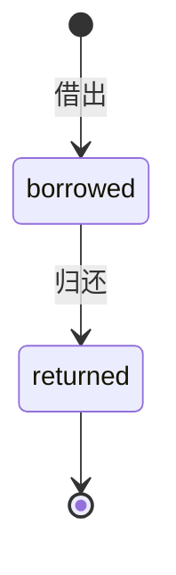

# Library API 需求规格说明书

| 属性 | 内容 |
|---|---|
| 文档版本 | 1.0 |
| API 版本 | 0.1.0 |
| OpenAPI 版本 | 3.1.0 |
| 服务名称 | Library API |
| 基础路径 | `http://<host>:<port>` |
| 认证方式 | HTTP Bearer JWT |
| 数据存储 | SQLite + SQLAlchemy ORM |
| 文档来源 | FastAPI OpenAPI、Pydantic Schema、路由业务逻辑 |

## 1. 文档目的

本文档定义图书借阅管理 API 的功能、接口契约、业务规则和验收条件，作为 V2 需求解析 Agent 二次验证的输入。

OpenAPI 是接口结构的机器契约；本文档补充副本数、押金和借阅状态机规则。

## 2. 系统范围

Library 是一个用于验证测试框架通用性的最小图书借阅后端，提供：

- 用户注册、登录和当前用户查询；
- 图书列表、创建、详情、更新和下架；
- 借书、归还和我的借阅列表；
- 服务存活检查。

当前版本不包含逾期罚金、预约和管理员角色。

## 3. 术语

| 术语 | 定义 |
|---|---|
| 在架图书 | `status = on_shelf`，允许借出 |
| 下架图书 | `status = off_shelf`，记录保留但禁止借出 |
| 借阅中 | `status = borrowed`，允许归还 |
| 已归还 | `status = returned`，终态 |
| 软删除 | 不删除数据库记录，只改变资源状态 |

## 4. 全局约定

### 4.1 数据格式

- 请求体和响应体使用 `application/json`。
- 未通过 FastAPI/Pydantic 校验时返回 `422`。
- 业务错误响应采用 `{"detail": "错误说明"}`。

### 4.2 认证

```http
Authorization: Bearer <access_token>
```

Token 缺失、格式错误、签名错误或过期时返回 `401`。

### 4.3 分页

| 参数 | 类型 | 默认值 | 约束 |
|---|---|---:|---|
| `page` | integer | 1 | `page >= 1` |
| `size` | integer | 10 | `1 <= size <= 100` |

## 5. 数据模型

### 5.1 User

| 字段 | 类型 | 约束 | 说明 |
|---|---|---|---|
| `id` | integer | 主键 | 用户 ID |
| `username` | string | 唯一 | 用户名 |
| `deposit` | number | 默认 500.00 | 押金余额 |
| `created_at` | datetime | 必填 | 创建时间 |

### 5.2 Book

| 字段 | 类型 | 约束 | 说明 |
|---|---|---|---|
| `id` | integer | 主键 | 图书 ID |
| `title` | string | 1–100 字符 | 书名 |
| `author` | string | 0–100 字符 | 作者 |
| `deposit` | number | `押金 > 0` | 单册押金 |
| `total_copies` | integer | `total_copies >= 1` | 馆藏总副本 |
| `available_copies` | integer | `0 <= available_copies <= total_copies` | 可借副本 |
| `status` | string | `on_shelf` / `off_shelf` | 图书状态 |

### 5.3 Borrow

| 字段 | 类型 | 约束 | 说明 |
|---|---|---|---|
| `id` | integer | 主键 | 借阅 ID |
| `user_id` | integer | 外键 | 借阅人 |
| `book_id` | integer | 外键 | 图书 |
| `deposit_charged` | number | 借出时押金快照 | 归还时按此金额返还 |
| `status` | string | `borrowed` / `returned` | 借阅状态 |

## 6. 借阅状态机



业务要求：

- `borrowed` 可以流转到 `returned`。
- `returned` 为终态，重复归还返回 `409`。
- 非法流转不得再次修改副本数、押金或借阅状态。

## 7. 接口需求

### 7.1 健康检查

#### REQ-LIB-META-001 `GET /health`

检查服务进程是否能够处理 HTTP 请求。

认证：不需要。

成功响应 `200`：`{"status": "ok"}`

### 7.2 用户认证

#### REQ-LIB-AUTH-001 `POST /api/auth/register`

注册新读者，并设置默认押金余额。

认证：不需要。

请求体：

| 字段 | 类型 | 必填 | 约束 |
|---|---|---|---|
| `username` | string | 是 | 3–20 字符 |
| `password` | string | 是 | 6–32 字符 |

成功响应 `201`，返回 `{"id", "username", "deposit"}`，`deposit` 等于默认押金。

错误响应：

| 状态码 | 条件 | `detail` |
|---:|---|---|
| 409 | 重复用户名 | `Username already exists` |
| 422 | 用户名或密码长度不合法（含用户名边界） | FastAPI 校验错误 |

#### REQ-LIB-AUTH-002 `POST /api/auth/login`

验证用户名和密码，返回 Bearer Token。

认证：不需要。

错误响应：`401` 密码错误或用户不存在（错误信息一致，避免泄露已注册用户名）。

#### REQ-LIB-AUTH-003 `GET /api/auth/me`

返回当前 Token 对应的用户信息。认证：需要。`401` 当 Token 缺失或无效。

### 7.3 图书管理

#### REQ-LIB-BOOK-001 `GET /api/books`

分页查询图书。认证：不需要。

分页约束：`page >= 1`、`1 <= size <= 100`，非法返回 `422`。

#### REQ-LIB-BOOK-002 `POST /api/books`

创建图书。认证：需要。

请求体：

```json
{"title": "Refactoring", "author": "Martin Fowler", "deposit": 30.0, "total_copies": 3}
```

字段约束：`title` 1–100 字符；押金 `deposit > 0`；`total_copies >= 1`。

成功响应 `201`，新图书默认 `status = on_shelf` 且 `available_copies = total_copies`。

数据库验收：新增一条图书记录，响应字段与数据库一致。

#### REQ-LIB-BOOK-003 `GET /api/books/{book_id}`

查询图书详情。认证：不需要。图书不存在返回 `404`。

#### REQ-LIB-BOOK-004 `PUT /api/books/{book_id}`

更新图书信息。认证：需要。所有字段可选；`available_copies` 始终不超过更新后的 `total_copies`。

#### REQ-LIB-BOOK-005 `DELETE /api/books/{book_id}`

下架图书（软删除）：`status` 置为 `off_shelf`，记录保留。认证：需要。

### 7.4 借阅

所有借阅接口均需要认证。

#### REQ-LIB-BORROW-001 `POST /api/borrows`

为当前用户借出图书。

请求体：`{"book_id": 1}`

创建前置条件按顺序为：

1. 图书存在；
2. 图书状态为 `on_shelf`；
3. `available_copies >= 1`；
4. 当前用户押金余额不少于图书押金。

成功响应 `201`。成功副作用必须在同一事务中完成：

```text
book.available_copies_after = book.available_copies_before - 1
user.deposit_after = user.deposit_before - book.deposit
borrow.status = borrowed
borrow.deposit_charged = book.deposit（押金快照）
```

失败不变量：任意前置条件失败时，可借副本、押金余额和借阅记录数均不得变化。

错误响应：

| 状态码 | 条件 | `detail` |
|---:|---|---|
| 400 | 图书已下架 | `Book is not on shelf` |
| 400 | 副本不足 | `No available copies` |
| 400 | 押金不足 | `Insufficient deposit` |
| 401 | Token 缺失或无效 | `Invalid or missing credentials` |
| 404 | 图书不存在 | `Book not found` |
| 422 | 请求体不符合约束 | FastAPI 校验错误 |

#### REQ-LIB-BORROW-002 `POST /api/borrows/{borrow_id}/return`

归还当前用户的借阅中图书。成功响应 `200`。

成功副作用：

```text
book.available_copies_after = book.available_copies_before + 1
user.deposit_after = user.deposit_before + borrow.deposit_charged
borrow.status = returned
```

错误响应：

| 状态码 | 条件 |
|---:|---|
| 401 | 未认证 |
| 404 | 借阅不存在或不属于当前用户 |
| 409 | 已归还的借阅不能再次归还（状态不得变化） |

安全要求：其他用户的借阅记录同样返回 `404`。

#### REQ-LIB-BORROW-003 `GET /api/borrows`

分页查询当前用户自己的借阅记录，按借阅 ID 升序。

## 8. 数据一致性要求

### REQ-LIB-DATA-001 借出原子性

扣减副本、扣减押金和创建借阅记录必须全部成功或全部失败。

### REQ-LIB-DATA-002 归还原子性

恢复副本、返还押金和更新借阅状态必须全部成功或全部失败。

### REQ-LIB-DATA-003 押金快照

押金在借出时保存。图书后续调整押金不得影响历史借阅的返还金额。

### REQ-LIB-DATA-004 资源隔离

用户只能查询和归还自己的借阅记录。

## 9. 安全要求

- 密码使用 PBKDF2-SHA256 加盐哈希保存。
- API 响应不得返回密码或密码哈希。
- Token、密码和数据库连接串不得写入测试证据或报告。

## 10. 可测试性要求

- FastAPI 必须提供 `/openapi.json` 作为运行时契约。
- 测试请求应携带唯一 `request_id`，用于后续关联日志。
- 关键业务测试必须保存 HTTP 响应和数据库 before/after 快照。
- 缺少关键证据时结论为 `INCONCLUSIVE`，不得判定为 `PASS`。

## 11. 核心验收矩阵

| 需求 ID | 场景 | HTTP 断言 | 数据断言 |
|---|---|---|---|
| REQ-LIB-AUTH-001 | 正常注册 | 201 | 用户新增、押金为默认值 |
| REQ-LIB-AUTH-001 | 用户名边界 | 422 | 不新增用户 |
| REQ-LIB-AUTH-002 | 正常登录 | 200、Token 存在 | 无业务数据变化 |
| REQ-LIB-BOOK-002 | 创建图书 | 201 | 图书记录存在且字段一致 |
| REQ-LIB-BOOK-005 | 下架图书 | 200 | 状态 `off_shelf`、记录保留 |
| REQ-LIB-BORROW-001 | 正常借书 | 201 | 副本 -1、押金减少、借阅新增 |
| REQ-LIB-BORROW-001 | 副本不足 | 400 | 副本、押金、借阅数不变 |
| REQ-LIB-BORROW-001 | 押金不足 | 400 | 副本、押金、借阅数不变 |
| REQ-LIB-BORROW-002 | 正常归还 | 200 | 副本恢复、押金返还、状态 `returned` |
| REQ-LIB-BORROW-002 | 重复归还 | 409 | 状态、副本、押金不变 |
| REQ-LIB-BORROW-002 | 归还他人借阅 | 404 | 不泄露他人资源、无状态变化 |
