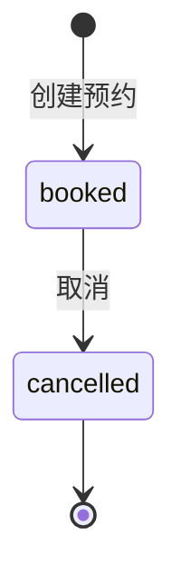

# Meeting Room API 需求规格说明书

| 属性 | 内容 |
|---|---|
| 文档版本 | 1.0 |
| API 版本 | 0.1.0 |
| OpenAPI 版本 | 3.1.0 |
| 服务名称 | Meeting Room API |
| 基础路径 | `http://<host>:<port>` |
| 认证方式 | HTTP Bearer JWT |
| 数据存储 | SQLite + SQLAlchemy ORM |
| 文档来源 | FastAPI OpenAPI、Pydantic Schema、路由业务逻辑 |

## 1. 文档目的

本文档定义会议室预约 API 的功能、接口契约、业务规则和验收条件，作为 V2 需求解析 Agent 第三个被测对象的输入。核心业务维度是时间冲突：同一会议室在重叠时间窗内只允许一笔生效预约。

## 2. 系统范围

Meeting 是一个用于验证测试框架时间类规则的最小会议室预约后端，提供：

- 用户注册、登录和当前用户查询；
- 会议室列表、创建、详情、更新和停用；
- 预约创建、取消和我的预约列表；
- 服务存活检查。

当前版本不包含定期预约、审批流和附件能力。

## 3. 术语

| 术语 | 定义 |
|---|---|
| 可用会议室 | `status = active`，允许预约 |
| 停用会议室 | `status = disabled`，记录保留但禁止预约 |
| 预约中 | `status = booked`，允许取消 |
| 已取消 | `status = cancelled`，终态 |
| 时间重叠 | 两个预约的 `[start, end)` 区间存在交集 |

## 4. 全局约定

### 4.1 数据格式

- 请求体和响应体使用 `application/json`。
- 时间字段使用 ISO 8601 日期时间字符串。
- 未通过 FastAPI/Pydantic 校验时返回 `422`。
- 业务错误响应采用 `{"detail": "错误说明"}`。

### 4.2 认证

```http
Authorization: Bearer <access_token>
```

Token 缺失、格式错误、签名错误或过期时返回 `401`。

### 4.3 分页

分页约束：`page >= 1`、`1 <= size <= 100`，非法返回 `422`。

## 5. 数据模型

### 5.1 User

| 字段 | 类型 | 约束 | 说明 |
|---|---|---|---|
| `id` | integer | 主键 | 用户 ID |
| `username` | string | 唯一 | 用户名 |
| `balance` | number | 默认 1000.00 | 预存余额 |
| `created_at` | datetime | 必填 | 创建时间 |

### 5.2 Room

| 字段 | 类型 | 约束 | 说明 |
|---|---|---|---|
| `id` | integer | 主键 | 会议室 ID |
| `name` | string | 1–50 字符 | 会议室名称 |
| `capacity` | integer | `capacity >= 1` | 容纳人数 |
| `hourly_price` | number | 每小时单价必须大于 0 | 计费单价 |
| `status` | string | `active` / `disabled` | 会议室状态 |

### 5.3 Booking

| 字段 | 类型 | 约束 | 说明 |
|---|---|---|---|
| `id` | integer | 主键 | 预约 ID |
| `user_id` | integer | 外键 | 预约人 |
| `room_id` | integer | 外键 | 会议室 |
| `start_time` | datetime | 必填 | 开始时间 |
| `end_time` | datetime | 必填、必须晚于开始时间 | 结束时间 |
| `amount` | number | 单价 × 时长 | 预约时的金额快照 |
| `status` | string | `booked` / `cancelled` | 预约状态 |

## 6. 预约状态机



业务要求：

- `booked` 可以流转到 `cancelled`。
- `cancelled` 为终态，重复取消返回 `409`。
- 非法流转不得再次修改余额或预约状态。

## 7. 接口需求

### 7.1 健康检查

#### REQ-MEET-META-001 `GET /health`

检查服务进程是否能够处理 HTTP 请求。

认证：不需要。

成功响应 `200`：`{"status": "ok"}`

### 7.2 用户认证

#### REQ-MEET-AUTH-001 `POST /api/auth/register`

注册新用户，并设置默认预存余额。

认证：不需要。

请求体：

| 字段 | 类型 | 必填 | 约束 |
|---|---|---|---|
| `username` | string | 是 | 3–20 字符 |
| `password` | string | 是 | 6–32 字符 |

成功响应 `201`，`balance` 等于默认预存余额。

错误响应：

| 状态码 | 条件 | `detail` |
|---:|---|---|
| 409 | 重复用户名 | `Username already exists` |
| 422 | 用户名边界或密码长度不合法 | FastAPI 校验错误 |

#### REQ-MEET-AUTH-002 `POST /api/auth/login`

验证用户名和密码，返回 Bearer Token。

认证：不需要。

错误响应：`401` 密码错误或用户不存在（错误信息一致，避免泄露已注册用户名）。

#### REQ-MEET-AUTH-003 `GET /api/auth/me`

返回当前 Token 对应的用户信息。认证：需要。`401` 当 Token 缺失或无效。

### 7.3 会议室管理

#### REQ-MEET-ROOM-001 `GET /api/rooms`

分页查询会议室。认证：不需要。非法分页约束返回 `422`。

#### REQ-MEET-ROOM-002 `POST /api/rooms`

创建会议室。认证：需要。

请求体：

```json
{"name": "Alpha", "capacity": 10, "hourly_price": 10.0}
```

字段约束：`name` 1–50 字符；`capacity >= 1`；每小时单价必须大于 0。

成功响应 `201`，新会议室默认 `status = active`。

数据库验收：新增一条会议室记录，响应字段与数据库一致。

#### REQ-MEET-ROOM-003 `GET /api/rooms/{room_id}`

查询会议室详情。认证：不需要。会议室不存在返回 `404`。

#### REQ-MEET-ROOM-004 `PUT /api/rooms/{room_id}`

更新会议室信息。认证：需要。所有字段可选。

#### REQ-MEET-ROOM-005 `DELETE /api/rooms/{room_id}`

停用会议室（软删除）：`status` 置为 `disabled`，记录保留。认证：需要。

### 7.4 预约

所有预约接口均需要认证。

#### REQ-MEET-BOOK-001 `POST /api/bookings`

为当前用户创建会议室预约。

请求体：

```json
{"room_id": 1, "start_time": "2031-03-01T10:00:00", "end_time": "2031-03-01T11:00:00"}
```

请求体约束（违反返回 `422` 校验错误数组）：`end_time` 必须晚于 `start_time`。

创建业务前置条件按顺序为：

1. 会议室存在；
2. 会议室状态为 `active`；
3. 与同一会议室既有 `booked` 预约时间不重叠；
4. 当前用户预存余额足够支付预约金额。

预约金额计算：`amount = round(hourly_price × 时长小时数, 2)`。

成功响应 `201`。成功副作用必须在同一事务中完成：

```text
user.balance_after = user.balance_before - amount
booking.status = booked
booking.amount = amount（金额快照）
```

失败不变量：任意前置条件失败时，预存余额和预约记录数均不得变化。

错误响应：

| 状态码 | 条件 | `detail` |
|---:|---|---|
| 400 | 会议室已停用 | `Room is disabled` |
| 400 | 预存余额不够 | `Balance is not enough` |
| 401 | Token 缺失或无效 | `Invalid or missing credentials` |
| 404 | 会议室不存在 | `Room not found` |
| 409 | 时间重叠 | `Time slot conflict` |
| 422 | 请求体不符合约束 | FastAPI 校验错误 |

相邻时段（如 10:00-11:00 与 11:00-12:00）不视为重叠，允许预约。

#### REQ-MEET-BOOK-002 `POST /api/bookings/{booking_id}/cancel`

取消当前用户的预约中记录。成功响应 `200`。

成功副作用：

```text
user.balance_after = user.balance_before + booking.amount
booking.status = cancelled
```

错误响应：

| 状态码 | 条件 |
|---:|---|
| 401 | 未认证 |
| 404 | 预约不存在或不属于当前用户 |
| 409 | 已取消预约不能再次取消（状态不得变化） |

安全要求：其他用户的预约同样返回 `404`。

#### REQ-MEET-BOOK-003 `GET /api/bookings`

分页查询当前用户自己的预约记录，按预约 ID 升序。

## 8. 数据一致性要求

### REQ-MEET-DATA-001 预约原子性

扣减余额和创建预约记录必须全部成功或全部失败。

### REQ-MEET-DATA-002 取消原子性

返还余额和更新预约状态必须全部成功或全部失败。

### REQ-MEET-DATA-003 金额快照

预约金额在创建时保存。会议室后续调价不得影响历史预约的取消返还金额。

### REQ-MEET-DATA-004 时间窗唯一性

同一会议室任意时刻最多只有一笔 `booked` 预约覆盖。

### REQ-MEET-DATA-005 资源隔离

用户只能查询和取消自己的预约记录。

## 9. 安全要求

- 密码使用 PBKDF2-SHA256 加盐哈希保存。
- API 响应不得返回密码或密码哈希。
- Token、密码和数据库连接串不得写入测试证据或报告。

## 10. 可测试性要求

- FastAPI 必须提供 `/openapi.json` 作为运行时契约。
- 测试请求应携带唯一 `request_id`，用于后续关联日志。
- 关键业务测试必须保存 HTTP 响应和数据库 before/after 快照。
- 缺少关键证据时结论为 `INCONCLUSIVE`，不得判定为 `PASS`。

## 11. 核心验收矩阵

| 需求 ID | 场景 | HTTP 断言 | 数据断言 |
|---|---|---|---|
| REQ-MEET-AUTH-001 | 正常注册 | 201 | 用户新增、预存余额为默认值 |
| REQ-MEET-AUTH-001 | 用户名边界 | 422 | 不新增用户 |
| REQ-MEET-AUTH-002 | 正常登录 | 200、Token 存在 | 无业务数据变化 |
| REQ-MEET-ROOM-002 | 创建会议室 | 201 | 会议室记录存在且字段一致 |
| REQ-MEET-ROOM-005 | 停用会议室 | 200 | 状态 `disabled`、记录保留 |
| REQ-MEET-BOOK-001 | 正常预约 | 201 | 余额减少、预约新增、金额正确 |
| REQ-MEET-BOOK-001 | 相邻时段预约 | 201 | 视为不重叠、正常扣费 |
| REQ-MEET-BOOK-001 | 时间重叠 | 409 | 余额、预约数不变 |
| REQ-MEET-BOOK-001 | 预存余额不够 | 400 | 余额、预约数不变 |
| REQ-MEET-BOOK-002 | 正常取消 | 200 | 余额返还、状态 `cancelled` |
| REQ-MEET-BOOK-002 | 重复取消 | 409 | 状态、余额不变 |
| REQ-MEET-BOOK-002 | 取消他人预约 | 404 | 不泄露他人资源、无状态变化 |
