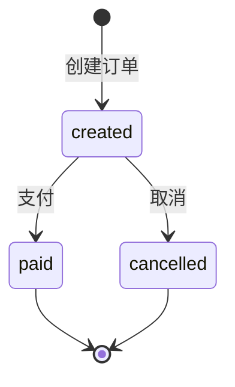

# Mini Shop API 需求规格说明书

| 属性 | 内容 |
|---|---|
| 文档版本 | 1.0 |
| API 版本 | 0.1.0 |
| OpenAPI 版本 | 3.1.0 |
| 服务名称 | Mini Shop API |
| 基础路径 | `http://<host>:<port>` |
| 认证方式 | HTTP Bearer JWT |
| 数据存储 | SQLite + SQLAlchemy ORM |
| 文档来源 | FastAPI OpenAPI、Pydantic Schema、路由业务逻辑 |

## 1. 文档目的

本文档定义 Mini Shop API 的功能、接口契约、业务规则、数据库副作用和验收条件。它既供开发和测试人员评审，也作为接口自动化 Agent 生成用例时的业务需求来源。

OpenAPI 是接口结构的机器契约；本文档补充 OpenAPI 不足以表达的库存、余额、订单状态和事务回滚规则。

## 2. 系统范围

Mini Shop 是一个用于 API 自动化测试验证的最小商城后端，提供：

- 用户注册、登录和当前用户查询；
- 商品列表、详情、创建、更新和下架；
- 订单创建、列表、详情、支付和取消；
- 订单相关库存和用户余额管理；
- 服务存活检查。

当前版本不包含购物车、优惠券、真实支付渠道、配送、退款、管理员角色和多租户能力。

## 3. 术语

| 术语 | 定义 |
|---|---|
| 在售商品 | `status = on_sale`，允许创建订单 |
| 下架商品 | `status = off_sale`，记录保留但禁止下单 |
| 已创建订单 | `status = created`，允许支付或取消 |
| 已支付订单 | `status = paid`，终态 |
| 已取消订单 | `status = cancelled`，终态，库存和余额已恢复 |
| 软删除 | 不删除数据库记录，只改变资源状态 |
| 当前用户 | Bearer Token 所代表的用户 |

## 4. 全局约定

### 4.1 数据格式

- 请求体和响应体使用 `application/json`。
- 时间字段使用 ISO 8601 日期时间字符串。
- 未通过 FastAPI/Pydantic 参数校验时返回 `422`。
- 业务错误响应采用 `{"detail": "错误说明"}`。

### 4.2 认证

需要认证的接口必须携带：

```http
Authorization: Bearer <access_token>
```

Token 缺失、格式错误、签名错误、过期或用户不存在时，系统返回：

```http
HTTP/1.1 401 Unauthorized
WWW-Authenticate: Bearer
```

```json
{
  "detail": "Invalid or missing credentials"
}
```

默认 Token 有效期为 60 分钟，可通过环境配置修改。

### 4.3 分页

列表接口采用以下分页规则：

| 参数 | 类型 | 默认值 | 约束 |
|---|---:|---:|---|
| `page` | integer | 1 | `page >= 1` |
| `size` | integer | 10 | `1 <= size <= 100` |

列表响应统一包含 `total`、`page`、`size` 和 `items`。

### 4.4 通用状态码

| 状态码 | 含义 |
|---:|---|
| 200 | 查询或状态变更成功 |
| 201 | 资源创建成功 |
| 400 | 业务前置条件不满足 |
| 401 | 缺少或使用了无效认证信息 |
| 404 | 资源不存在，或当前用户不可访问该资源 |
| 409 | 资源冲突或当前状态不允许操作 |
| 422 | 请求参数或请求体不符合数据约束 |

## 5. 数据模型

### 5.1 User

| 字段 | 类型 | 约束 | 说明 |
|---|---|---|---|
| `id` | integer | 主键 | 用户 ID |
| `username` | string | 唯一 | 用户名 |
| `password_hash` | string | 不对外返回 | 密码哈希，不保存明文密码 |
| `balance` | number | 默认 1000.00 | 可用余额 |
| `created_at` | datetime | 必填 | 创建时间 |

### 5.2 Product

| 字段 | 类型 | 约束 | 说明 |
|---|---|---|---|
| `id` | integer | 主键 | 商品 ID |
| `name` | string | 1–100 字符 | 商品名称 |
| `price` | number | `price > 0` | 商品单价 |
| `stock` | integer | `stock >= 0` | 可售库存 |
| `status` | string | `on_sale` / `off_sale` | 商品状态 |
| `created_at` | datetime | 必填 | 创建时间 |

### 5.3 Order

| 字段 | 类型 | 约束 | 说明 |
|---|---|---|---|
| `id` | integer | 主键 | 订单 ID |
| `user_id` | integer | 外键 | 订单所属用户 |
| `product_id` | integer | 外键 | 对应商品 |
| `quantity` | integer | 1–100 | 购买数量 |
| `amount` | number | 单价 × 数量 | 下单时的金额快照 |
| `status` | string | `created` / `paid` / `cancelled` | 订单状态 |
| `created_at` | datetime | 必填 | 创建时间 |

## 6. 订单状态机



业务要求：

- `created` 可以流转到 `paid` 或 `cancelled`。
- `paid` 和 `cancelled` 均为终态。
- 对终态订单再次支付或取消必须返回 `409`。
- 非法流转不得再次修改库存、余额或订单状态。

## 7. 接口需求

### 7.1 健康检查

#### REQ-META-001 `GET /health`

检查服务进程是否能够处理 HTTP 请求。

认证：不需要。

成功响应 `200`：

```json
{
  "status": "ok"
}
```

验收条件：

- 服务启动完成后返回 `200`。
- `status` 等于 `ok`。
- 当前接口仅表示应用存活，不保证数据库就绪。

### 7.2 用户认证

#### REQ-AUTH-001 `POST /api/auth/register`

注册新用户，并为其设置默认余额。

认证：不需要。

请求体：

| 字段 | 类型 | 必填 | 约束 |
|---|---|---|---|
| `username` | string | 是 | 3–20 字符 |
| `password` | string | 是 | 6–32 字符 |

示例：

```json
{
  "username": "alice",
  "password": "Test123456"
}
```

成功响应 `201`：

```json
{
  "id": 1,
  "username": "alice",
  "balance": 1000.0,
  "created_at": "2026-09-01T08:00:00Z"
}
```

错误响应：

| 状态码 | 条件 | `detail` |
|---:|---|---|
| 409 | 用户名已存在 | `Username already exists` |
| 422 | 用户名或密码长度不合法 | FastAPI 校验错误 |

验收条件：

- 用户名在数据库中唯一。
- 密码必须以哈希形式保存，不得保存或返回明文。
- 注册成功后用户余额等于配置的默认余额。

#### REQ-AUTH-002 `POST /api/auth/login`

验证用户名和密码，返回 Bearer Token。

认证：不需要。

请求体：

```json
{
  "username": "alice",
  "password": "Test123456"
}
```

成功响应 `200`：

```json
{
  "access_token": "<jwt>",
  "token_type": "bearer"
}
```

错误响应：

| 状态码 | 条件 | `detail` |
|---:|---|---|
| 401 | 用户不存在或密码错误 | `Incorrect username or password` |
| 422 | 请求体缺少字段或类型不合法 | FastAPI 校验错误 |

安全要求：用户不存在和密码错误必须返回相同错误，避免泄露已注册用户名。

#### REQ-AUTH-003 `GET /api/auth/me`

返回当前 Token 对应的用户信息。

认证：需要。

成功响应 `200`：返回 `User` 的公开字段，不得返回 `password_hash`。

错误响应：

| 状态码 | 条件 |
|---:|---|
| 401 | Token 缺失、无效、过期或对应用户不存在 |

## 7.3 商品

#### REQ-PRODUCT-001 `GET /api/products`

分页查询商品，支持名称关键词和状态过滤。

认证：不需要。

查询参数：

| 参数 | 类型 | 必填 | 约束 |
|---|---|---|---|
| `page` | integer | 否 | 默认 1，最小 1 |
| `size` | integer | 否 | 默认 10，范围 1–100 |
| `keyword` | string | 否 | 商品名称包含匹配 |
| `status` | string | 否 | `on_sale` 或 `off_sale` |

成功响应 `200`：

```json
{
  "total": 1,
  "page": 1,
  "size": 10,
  "items": [
    {
      "id": 1,
      "name": "Keyboard",
      "price": 99.0,
      "stock": 10,
      "status": "on_sale",
      "created_at": "2026-09-01T08:00:00Z"
    }
  ]
}
```

验收条件：结果按商品 ID 升序排列，`total` 为过滤后的总记录数。

#### REQ-PRODUCT-002 `GET /api/products/{product_id}`

查询指定商品详情。

认证：不需要。

错误响应：

| 状态码 | 条件 | `detail` |
|---:|---|---|
| 404 | 商品不存在 | `Product not found` |
| 422 | `product_id` 不是整数 | FastAPI 校验错误 |

#### REQ-PRODUCT-003 `POST /api/products`

创建商品。

认证：需要。当前 V1 不区分管理员和普通用户，任意已认证用户均可创建商品。

请求体：

```json
{
  "name": "Keyboard",
  "price": 99.0,
  "stock": 10
}
```

字段约束：

- `name` 长度为 1–100；
- `price > 0`；
- `stock >= 0`。

成功响应 `201`，新商品默认 `status = on_sale`。

数据库验收：必须新增一条商品记录，响应中的 ID、名称、价格、库存和数据库一致。

#### REQ-PRODUCT-004 `PUT /api/products/{product_id}`

更新商品信息。

认证：需要。当前 V1 不区分管理员和普通用户。

所有请求字段均为可选，只更新实际提交的字段：

```json
{
  "name": "Mechanical Keyboard",
  "price": 129.0,
  "stock": 20,
  "status": "on_sale"
}
```

错误响应：

| 状态码 | 条件 |
|---:|---|
| 401 | 未认证 |
| 404 | 商品不存在 |
| 422 | 字段值违反商品约束 |

数据库验收：已提交字段被更新，未提交字段保持不变。

#### REQ-PRODUCT-005 `DELETE /api/products/{product_id}`

下架商品。

认证：需要。当前 V1 不区分管理员和普通用户。

业务规则：

- 此操作是软删除，不得物理删除商品记录。
- 成功后将 `status` 修改为 `off_sale`。
- 历史订单对商品的引用必须保持有效。

成功响应 `200`，返回下架后的商品。

## 7.4 订单

所有订单接口均需要认证。

#### REQ-ORDER-001 `POST /api/orders`

为当前用户创建订单。

请求体：

```json
{
  "product_id": 1,
  "quantity": 2
}
```

字段约束：

- `product_id` 必须为整数；
- `quantity` 必须大于 0 且不超过 100。

创建前置条件按顺序为：

1. 商品存在；
2. 商品状态为 `on_sale`；
3. 商品库存不少于购买数量；
4. 当前用户余额不少于订单金额。

订单金额计算：

```text
amount = round(product.price * quantity, 2)
```

成功响应 `201`：

```json
{
  "id": 1,
  "user_id": 1,
  "product_id": 1,
  "quantity": 2,
  "amount": 198.0,
  "status": "created",
  "created_at": "2026-09-01T08:00:00Z"
}
```

错误响应：

| 状态码 | 条件 | `detail` |
|---:|---|---|
| 400 | 商品已下架 | `Product is not on sale` |
| 400 | 库存不足 | `Insufficient stock` |
| 400 | 余额不足 | `Insufficient balance` |
| 401 | 未认证 | `Invalid or missing credentials` |
| 404 | 商品不存在 | `Product not found` |
| 422 | 请求体不符合字段约束 | FastAPI 校验错误 |

成功副作用必须在同一事务中完成：

```text
product.stock_after = product.stock_before - quantity
user.balance_after = user.balance_before - amount
order_count_after = order_count_before + 1
order.status = created
```

失败不变量：任意前置条件失败时，库存、余额和订单总数均不得变化。

#### REQ-ORDER-002 `GET /api/orders`

分页查询当前用户自己的订单。

查询参数：

| 参数 | 类型 | 必填 | 约束 |
|---|---|---|---|
| `page` | integer | 否 | 默认 1，最小 1 |
| `size` | integer | 否 | 默认 10，范围 1–100 |
| `status` | string | 否 | `created`、`paid` 或 `cancelled` |

验收条件：

- 只能返回当前用户的订单；
- 结果按订单 ID 升序排列；
- `total` 是当前用户经过状态过滤后的订单数量。

#### REQ-ORDER-003 `GET /api/orders/{order_id}`

查询当前用户自己的订单详情。

错误响应：

| 状态码 | 条件 | `detail` |
|---:|---|---|
| 404 | 订单不存在或订单属于其他用户 | `Order not found` |
| 401 | 未认证 | `Invalid or missing credentials` |

安全要求：其他用户的订单也返回 `404`，避免通过状态码探测资源是否存在。

#### REQ-ORDER-004 `POST /api/orders/{order_id}/pay`

支付当前用户的已创建订单。

成功条件：订单当前状态必须为 `created`。

成功响应 `200`，并将订单状态修改为 `paid`。

错误响应：

| 状态码 | 条件 |
|---:|---|
| 401 | 未认证 |
| 404 | 订单不存在或不属于当前用户 |
| 409 | 订单状态不是 `created` |

验收条件：重复支付返回 `409`，订单继续保持 `paid`，不得重复扣库存或余额。

#### REQ-ORDER-005 `POST /api/orders/{order_id}/cancel`

取消当前用户的已创建订单。

成功条件：订单当前状态必须为 `created`。

成功副作用：

```text
product.stock_after = product.stock_before_cancel + order.quantity
user.balance_after = user.balance_before_cancel + order.amount
order.status = cancelled
```

从完整业务流程观察，取消完成后的库存和余额应恢复到下单前的值。

错误响应：

| 状态码 | 条件 |
|---:|---|
| 401 | 未认证 |
| 404 | 订单不存在或不属于当前用户 |
| 409 | 订单状态不是 `created` |

验收条件：已支付订单和已取消订单不能再次取消；失败后不得重复增加库存或余额。

## 8. 数据一致性要求

### REQ-DATA-001 下单原子性

扣减库存、扣减余额和创建订单必须全部成功或全部失败，不允许部分提交。

### REQ-DATA-002 取消原子性

恢复库存、恢复余额和更新订单状态必须全部成功或全部失败。

### REQ-DATA-003 金额快照

订单金额在创建时保存。商品后续改价不得修改历史订单金额。

### REQ-DATA-004 资源隔离

用户只能查询、支付和取消自己的订单。

## 9. 安全要求

- 密码使用 PBKDF2-SHA256 加盐哈希保存。
- API 响应不得返回密码或密码哈希。
- JWT 至少包含用户标识和过期时间。
- Token、密码和数据库连接串不得写入测试证据或报告。
- 生产环境不得使用项目内置的开发密钥。
- 当前商品管理接口只要求登录，管理员角色属于后续版本范围。

## 10. 可测试性与可追溯要求

- FastAPI 必须提供 `/openapi.json` 作为运行时契约。
- 每次自动化执行前，必须比较基线契约与运行时契约。
- 破坏性契约变化应阻断旧脚本执行。
- 测试请求应携带唯一 `request_id`，用于后续关联日志。
- 关键业务测试必须保存 HTTP 响应和数据库 before/after 快照。
- 缺少关键证据时结论为 `INCONCLUSIVE`，不得判定为 `PASS`。

## 11. 核心验收矩阵

| 需求 ID | 场景 | HTTP 断言 | 数据断言 |
|---|---|---|---|
| REQ-AUTH-001 | 正常注册 | 201、响应结构正确 | 用户新增、余额为默认值 |
| REQ-AUTH-001 | 重复用户名 | 409 | 不新增重复用户 |
| REQ-AUTH-002 | 正常登录 | 200、Token 存在 | 无业务数据变化 |
| REQ-PRODUCT-003 | 创建商品 | 201 | 商品记录存在且字段一致 |
| REQ-PRODUCT-005 | 下架商品 | 200 | 记录保留、状态为 `off_sale` |
| REQ-ORDER-001 | 正常下单 | 201、响应结构正确 | 库存减少、余额减少、订单新增 |
| REQ-ORDER-001 | 库存不足 | 400 | 库存、余额、订单数不变 |
| REQ-ORDER-001 | 余额不足 | 400 | 库存、余额、订单数不变 |
| REQ-ORDER-003 | 跨用户查询 | 404 | 不泄露其他用户订单 |
| REQ-ORDER-004 | 正常支付 | 200 | 状态为 `paid` |
| REQ-ORDER-004 | 重复支付 | 409 | 状态保持 `paid`，无重复副作用 |
| REQ-ORDER-005 | 正常取消 | 200 | 状态取消、库存和余额恢复 |
| REQ-ORDER-005 | 取消已支付订单 | 409 | 库存、余额和状态不变 |

## 12. 当前版本限制与后续优化

以下内容不是当前 0.1.0 已实现能力：

- 商品管理员和普通买家角色区分；
- PostgreSQL、数据库迁移和生产级连接管理；
- 并发下单防超卖；
- 支付和取消的幂等键；
- 金额字段使用精确 `Decimal/Numeric`；
- 数据库 readiness 健康检查；
- 结构化业务日志和审计日志；
- Token 撤销、issuer、audience 和 refresh token。

这些限制不应被测试报告误写为已验证能力。
